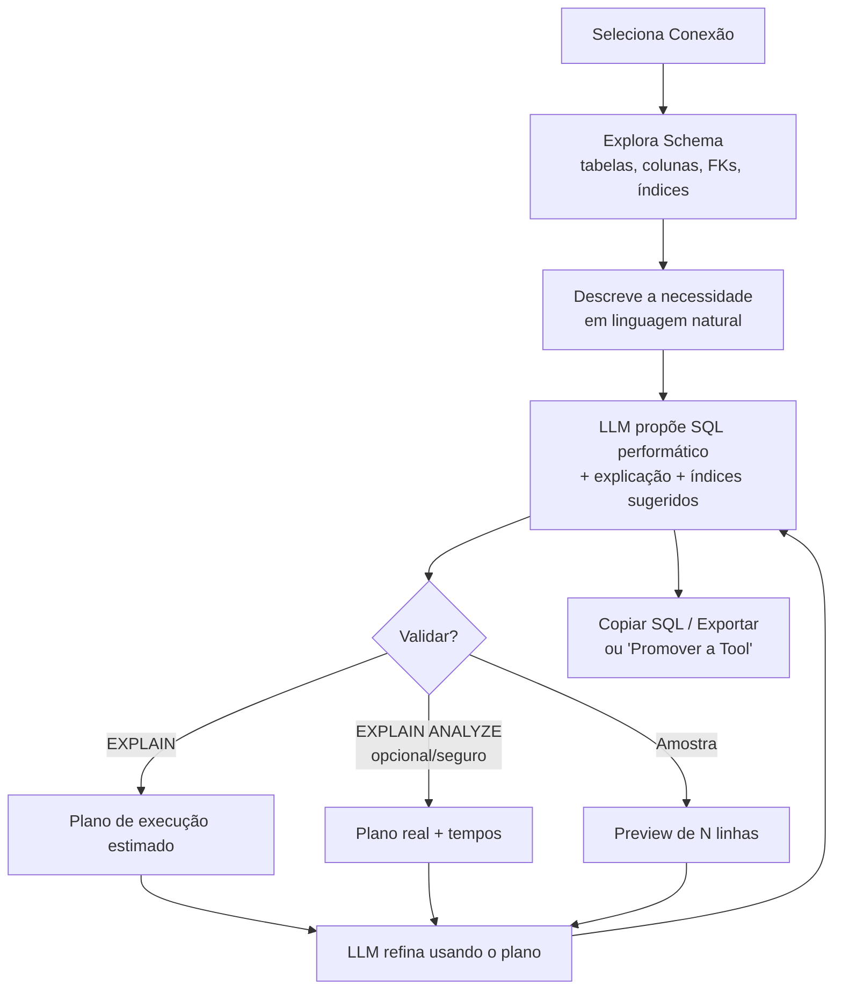

# PLANO — Módulo "Query Studio" (Assistente de Consultas SQL)

> Documento de planejamento. Não é código. Descreve um **novo módulo/menu**
> do ContextForge focado em **entender qual consulta o usuário precisa** e
> **gerar consultas SQL performáticas** para uso em qualquer sistema — não
> necessariamente como uma tool MCP.

---

## 1. Motivação

Hoje o ContextForge já é muito bom em ajudar a criar **tools MCP** a partir de
consultas SQL, e o motor de exploração de schema (`drivers.Introspect`) é
eficiente. Porém, alguns usuários passaram a usar o produto apenas para
**gerar SQL para outros sistemas** (relatórios, ETL, dashboards, código de
aplicação).

O fluxo atual (`ToolsPage` + `/api/llm/chat-tool`) foi desenhado para produzir
uma **tool** (slug, título, `params_schema`, `output_schema`, versão, ativação).
Isso adiciona atrito e conceitos irrelevantes para quem só quer **uma boa
query**. Além disso, o foco atual é *correção funcional* da query — não
*performance* (planos de execução, índices, anti-padrões).

**Objetivo**: criar um módulo dedicado, com menu próprio, cuja única missão é:

1. Conversar com o usuário para **entender a necessidade** da consulta.
2. Gerar SQL **performático e idiomático** para o dialeto da conexão.
3. **Validar/medir** a query (EXPLAIN / EXPLAIN ANALYZE, amostra de dados).
4. **Refinar** iterativamente com base no plano de execução real.
5. Entregar a query pronta para **copiar e usar em outro sistema** (com
   explicação, índices sugeridos e observações de performance).

---

## 2. Como se diferencia do módulo de Tools

| Aspecto | Módulo **Tools** (atual) | Módulo **Query Studio** (novo) |
| --- | --- | --- |
| Objetivo final | Criar/ativar uma tool MCP | Entregar SQL para uso externo |
| Artefato | `tools` (slug, schemas, versão) | Query + explicação + índices sugeridos |
| Parâmetros | `params_schema` JSON Schema (obrigatório p/ MCP) | Parâmetros opcionais/livres, foco em legibilidade |
| Foco do LLM | Correção + contrato MCP | **Performance** + correção + didática |
| Validação | Dry-run + ativação | EXPLAIN/ANALYZE + amostra + heurísticas |
| Persistência | Tabela `tools`, versionada | Histórico leve de "sessões de query" (opcional) |
| Roles | admin + editor | admin + editor (mesma fronteira) |

O novo módulo **reaproveita ao máximo** a infraestrutura existente: conexões,
`Introspect`, cliente OpenRouter (`llm.Client`), padrões de rota (`Mount`) e
padrões de página React (`api()` + TanStack Query).

---

## 3. Nome e navegação

- **Nome do menu**: `Query Studio` (rótulo visível em PT pode ser
  "Estúdio de Consultas").
- **Rota**: `/query-studio`.
- **Ícone**: reutilizar estilo dos ícones existentes em `App.tsx` (ex.: ícone
  de "banco/consulta").
- **Posição no menu**: logo abaixo de **Tools**, pois compartilham o conceito
  de conexão + schema.

---

## 4. Experiência do usuário (fluxo)



Passos detalhados:

1. **Escolher conexão**: dropdown alimentado por `GET /api/connections`.
2. **Explorar schema**: chamar `GET /api/connections/{id}/introspect` (motor
   atual). Ver seção 7 sobre **enriquecer** a introspecção com FKs e índices.
3. **Descrever a necessidade**: chat livre. O usuário pode falar objetivos de
   negócio ("faturamento por cliente no último trimestre"), não SQL.
4. **Receber proposta**: o LLM retorna:
   - `query` (SQL para o dialeto),
   - `explanation` (o que a query faz, em PT),
   - `suggested_indexes` (DDL de índices que acelerariam a query),
   - `performance_notes` (anti-padrões evitados, avisos),
   - `assumptions` (premissas que fez sobre o schema).
5. **Validar** (botões):
   - **EXPLAIN** (padrão, seguro, sem executar a query).
   - **EXPLAIN ANALYZE** (opcional; executa de fato — ver seção 8 Segurança).
   - **Preview** (amostra limitada de linhas, com `LIMIT` forçado).
6. **Refinar**: o resultado do EXPLAIN/erro/amostra volta ao LLM para nova
   iteração ("o índice X não é usado, reescreva evitando função na coluna Y").
7. **Entregar**:
   - **Copiar SQL** (com/sem comentários).
   - **Exportar** (`.sql`).
   - **Promover a Tool** (atalho que abre o fluxo de criação de tool já
     preenchido — ponte entre os dois módulos, opcional na Fase 3).

---

## 5. Arquitetura — Backend

### 5.1 Novos endpoints (grupo `admin` + `editor`, registrados em `Mount`)

Registrar em `internal/api/handlers_llm_router.go::Mount`, no grupo
`RequireAuth("admin","editor")`, junto aos demais `/llm/*`:

| Método | Rota | Handler | Descrição |
| --- | --- | --- | --- |
| POST | `/api/query-studio/chat` | `QueryStudioChat` | Multi-turn: recebe schema + histórico + query atual; devolve SQL + explicação + índices + notas de performance. |
| POST | `/api/query-studio/explain` | `QueryStudioExplain` | Roda `EXPLAIN` (e opcionalmente `ANALYZE`) da query proposta e devolve o plano estruturado/textual. |
| POST | `/api/query-studio/preview` | `QueryStudioPreview` | Executa a query com `LIMIT` forçado e devolve colunas + amostra (reusa `driver.Query`/executor com limites). |
| GET | `/api/query-studio/sessions` | `ListQuerySessions` | (Opcional, Fase 2) lista sessões salvas do usuário. Suporta paginação (`page`, `page_size`, `q`). |
| POST | `/api/query-studio/sessions` | `SaveQuerySession` | (Opcional, Fase 2) salva uma sessão (título + query + chat). |
| GET | `/api/query-studio/sessions/{id}` | `GetQuerySession` | (Opcional) detalhe de uma sessão. |
| DELETE | `/api/query-studio/sessions/{id}` | `DeleteQuerySession` | (Opcional) remove sessão. |

Arquivo novo sugerido: `internal/api/handlers_query_studio.go`. Reusar helpers
existentes: `writeJSON`, `writeErr`, `decodeBody`, `parseListParams`,
`writePage`, `currentUser`, `openDriver`.

### 5.2 Novos prompts LLM

Adicionar em `internal/llm/prompts.go` (seguindo o padrão de `ChatTool`):

```go
type QueryStudioInput struct {
    ConnectionKind string        // "pg" | "mysql" | ...
    Tables         []drivers.Table
    Relations      []Relation    // FKs (novo — ver 7)
    Indexes        []IndexInfo   // índices existentes (novo — ver 7)
    History        []Message
    CurrentQuery   string        // query em edição, se houver
    ExplainResult  string        // plano de execução da última validação (feedback loop)
}

type QueryStudioOutput struct {
    Reply            string      // resposta conversacional em PT
    Query            string      // SQL final proposto
    Explanation      string      // o que a query faz
    SuggestedIndexes []string    // DDL de índices sugeridos
    PerformanceNotes []string    // avisos/anti-padrões
    Assumptions      []string    // premissas sobre o schema
    Raw              string      // resposta bruta (debug)
}
```

**System prompt** — pontos-chave (dialeto-aware, como já é feito para
Firebird):

- Papel: "engenheiro de banco de dados sênior especialista em performance".
- **Objetivo é query para uso geral**, não uma tool MCP → **não** exigir
  `params_schema`/`slug`/`output_schema`.
- **Regras de performance** a aplicar e explicar:
  - Evitar `SELECT *`; listar apenas colunas necessárias.
  - Preferir JOINs a subconsultas correlacionadas quando possível.
  - Evitar funções sobre colunas indexadas em `WHERE` (quebra uso de índice).
  - Usar `EXISTS` em vez de `IN (subquery)` grande quando fizer sentido.
  - Alertar sobre `WHERE` ausente / varreduras completas.
  - Paginação com keyset em vez de `OFFSET` alto quando aplicável.
  - Sugerir índices (incluindo compostos e cobertura) coerentes com o dialeto.
  - Considerar tipos/cardinalidade a partir da introspecção.
- **Guias por dialeto** (Postgres/MySQL/MSSQL/Oracle/Firebird): sintaxe de
  `EXPLAIN`, `LIMIT`/`TOP`/`ROWNUM`/`FETCH FIRST`, criação de índice.
- **Somente SELECT** por padrão (sem DDL/DML executável); os índices sugeridos
  são **texto** para o usuário aplicar, nunca executados pelo módulo.
- Saída em **JSON** (`response_format: json_object`), como os prompts atuais.
- Quando receber `ExplainResult`, **usar o plano** para reescrever/otimizar e
  explicar o que mudou.

Método público análogo aos existentes: `func (c *Client) QueryStudioChat(ctx,
QueryStudioInput) (QueryStudioOutput, error)`.

### 5.3 EXPLAIN / análise de performance (por dialeto)

Estender a interface de driver (`internal/drivers/driver.go`) com um método
**opcional** de explain, mantendo compatibilidade (drivers que não suportam
retornam `ErrUnsupported`):

```go
// Optional capability. Drivers without support return drivers.ErrUnsupported.
type Explainer interface {
    Explain(ctx context.Context, query string, analyze bool) (ExplainResult, error)
}

type ExplainResult struct {
    Dialect string
    Plan    string   // texto do plano (ou JSON serializado)
    Format  string   // "text" | "json"
}
```

Sintaxe por dialeto (implementar por driver):

| Dialeto | EXPLAIN | EXPLAIN ANALYZE |
| --- | --- | --- |
| Postgres (`pg`) | `EXPLAIN (FORMAT JSON) <q>` | `EXPLAIN (ANALYZE, BUFFERS, FORMAT JSON) <q>` |
| MySQL | `EXPLAIN FORMAT=JSON <q>` | `EXPLAIN ANALYZE <q>` (8.0.18+) |
| MSSQL | `SET SHOWPLAN_XML ON` / estimado | Plano de execução real |
| Oracle | `EXPLAIN PLAN FOR <q>` + `DBMS_XPLAN` | via `V$SQL_PLAN` |
| Firebird | `SET PLAN ON` / plano textual | n/d |
| Mongo/REST | **não aplicável** → `ErrUnsupported` (UI desabilita botão) |

**Reuso**: a execução do EXPLAIN e do preview deve passar pelas mesmas
proteções de `drivers/safety.go` (parser SELECT-only, limites) e pelos limites
de tempo/linhas do executor.

### 5.4 Preview de dados

- Reusar a lógica de execução existente (executor/driver `Query`) com
  `LIMIT`/`TOP` **forçado** pelo backend (ex.: 100 linhas), timeout curto e
  sem cache por token (é sandbox de desenvolvimento).
- Nunca confiar no `LIMIT` que o LLM colocou; **impor** limite no servidor.

---

## 6. Arquitetura — Frontend

### 6.1 Wiring da página

- **Nova página**: `frontend/src/pages/QueryStudioPage.tsx`.
- **Menu**: adicionar entry no array `links` de `frontend/src/App.tsx`
  (label "Query Studio", ícone, rota `/query-studio`, roles admin+editor).
- **Rota**: declarar em `frontend/src/main.tsx` sob `RequireAuth`.
- **HTTP**: usar `api<T>()` de `frontend/src/auth.tsx` (auth automática).
- **Estado/dados**: TanStack Query, seguindo `ToolsPage.tsx`:
  - `["conns"]` → `/api/connections`
  - introspecção sob demanda → `/api/connections/{id}/introspect`
  - mutations → `/api/query-studio/chat`, `/explain`, `/preview`.

### 6.2 Layout proposto (3 colunas)

```
┌────────────┬───────────────────────────┬────────────────────┐
│ Schema     │ Chat / Requisito           │ SQL + Performance  │
│ (árvore)   │ (histórico + input)        │                    │
│ tabelas ▸  │ usuário: "faturamento..."  │ [ SQL editor ]     │
│  colunas   │ IA: proposta + explicação  │ Explicação (PT)    │
│  FKs       │                            │ Índices sugeridos  │
│  índices   │                            │ Notas de perf.     │
│            │                            │ [EXPLAIN][Preview] │
│            │                            │ [Copiar][Exportar] │
└────────────┴───────────────────────────┴────────────────────┘
```

- **Coluna Schema**: árvore navegável (reutiliza dados do `Introspect`;
  mostra FKs e índices quando disponíveis). Clicar em tabela/coluna insere
  referência no chat.
- **Coluna Chat**: conversa em linguagem natural; renderiza `reply`,
  `assumptions` e um botão "Usar esta query".
- **Coluna SQL**: `CodeEditor` (componente existente) com a query; abas/painéis
  para **Explicação**, **Índices sugeridos**, **Notas de performance**, e o
  **plano de execução** (resultado do EXPLAIN) + **preview** (tabela de
  amostra). Botões: EXPLAIN, EXPLAIN ANALYZE (com confirmação), Preview,
  Copiar, Exportar `.sql`, e (Fase 3) "Promover a Tool".

### 6.3 Componentes reutilizados

`CodeEditor`, `Badge`, `EmptyState`, `Pagination` (para histórico de sessões).

---

## 7. Enriquecer o motor de exploração de schema (FKs + índices)

O `Introspect` atual retorna apenas `Schema/Name/Columns`. Para **performance**
é muito útil conhecer **relacionamentos (FKs)** e **índices existentes**.

Proposta: adicionar um método **opcional** de introspecção estendida, sem
quebrar o `Introspect` atual:

```go
type RichIntrospector interface {
    IntrospectRich(ctx context.Context) (SchemaGraph, error)
}

type SchemaGraph struct {
    Tables    []Table
    Relations []Relation   // FKs: from(table,col) -> to(table,col)
    Indexes   []IndexInfo  // nome, tabela, colunas, unique
}
```

- **Postgres**: `pg_constraint` (FKs) + `pg_index`/`pg_indexes`.
- **MySQL**: `INFORMATION_SCHEMA.KEY_COLUMN_USAGE` + `STATISTICS`.
- **MSSQL/Oracle/Firebird**: catálogos equivalentes.
- Drivers sem suporte → cair no `Introspect` simples.

Esses dados entram no prompt (`Relations`, `Indexes`) para que o LLM proponha
JOINs corretos e **evite sugerir índices que já existem**.

> Esta melhoria pode ser **Fase 2**; a Fase 1 funciona só com `Introspect`
> atual + EXPLAIN.

---

## 8. Segurança e cuidados

1. **Somente leitura por padrão**: `query-studio/explain` e `/preview` devem
   passar pelo parser de `drivers/safety.go` e **rejeitar** qualquer coisa que
   não seja `SELECT`/`EXPLAIN`. Índices sugeridos são **texto**, nunca
   executados pelo servidor.
2. **EXPLAIN ANALYZE executa a query de verdade**: exigir **confirmação
   explícita** na UI e um flag `analyze:true` no request. Aplicar timeout curto.
   Considerar bloquear `ANALYZE` para queries sem `LIMIT`/potencialmente caras
   (heurística) e/ou torná-lo desabilitável por configuração.
3. **Limite forçado no preview**: `LIMIT` imposto pelo backend (ex.: 100),
   independente do que veio do LLM. Timeout de execução curto.
4. **Roles**: endpoints sob `RequireAuth("admin","editor")` (mesma fronteira do
   fluxo de tools). `viewer` não acessa.
5. **Cripto de conexão**: reutilizar `openDriver` (decripta config com AAD
   `connection:<id>`). Nada de expor DSN/segredos na resposta.
6. **Injeção**: a query roda **parametrizada/como está** apenas em EXPLAIN e
   preview sandbox; jamais interpolar entrada do usuário em SQL de
   introspecção. Manter todas as verificações de `safety.go`.
7. **LLM**: não enviar dados sensíveis/PII de linhas ao OpenRouter — enviar
   **apenas metadados de schema** (tabelas/colunas/FKs/índices) e o plano de
   EXPLAIN (que não contém dados de linha, só custos/estruturas). O preview de
   linhas fica **no cliente**, não é reenviado ao LLM por padrão.
8. **Auditoria**: registrar em `audit_logs` ações relevantes (ex.: execução de
   EXPLAIN ANALYZE), seguindo o padrão de `handlers_backup.go::audit`.
9. **Logs**: não logar query texts com PII nem segredos.

---

## 9. Modelo de dados (persistência opcional — Fase 2)

Se quisermos histórico de sessões de query por usuário:

Migration nova: `store/migrations/0005_query_sessions.{up,down}.sql`
(lembrar de **incluir o `down.sql`**).

```sql
-- up
CREATE TABLE query_sessions (
    id            UUID PRIMARY KEY DEFAULT gen_random_uuid(),
    connection_id UUID NOT NULL REFERENCES connections(id) ON DELETE CASCADE,
    title         TEXT NOT NULL,
    query_text    TEXT NOT NULL DEFAULT '',
    chat_log      JSONB NOT NULL DEFAULT '[]'::jsonb,
    last_explain  JSONB,                 -- último plano de execução
    created_by    UUID REFERENCES users(id) ON DELETE SET NULL,
    created_at    TIMESTAMPTZ NOT NULL DEFAULT now(),
    updated_at    TIMESTAMPTZ NOT NULL DEFAULT now()
);
CREATE INDEX idx_query_sessions_created_by ON query_sessions(created_by);
```

- Model correspondente em `internal/store/models.go` (`QuerySession`).
- Usar `nullableJSON` para colunas JSONB opcionais.
- **Fora do escopo do backup** por ora (como tokens/usuários), a menos que se
  decida o contrário — documentar a decisão.

> Nota: a Fase 1 pode manter todo o estado **no cliente** (sem persistência),
> reduzindo o escopo inicial.

---

## 10. Fases de entrega (micro-fases para o autopilot)

Cada micro-fase abaixo é dimensionada para **uma única execução do Claude**
(contexto limpo), termina com **testes verdes** e **um commit**. A coluna
"Depende de:" declara apenas dependências reais (para permitir paralelismo).
As fases marcadas com o gate extra `integration-postgres` precisam da suíte de
integração com testcontainers (ver §11 e a lista de gates do autopilot).

---

### Fase 1a — Prompt + método LLM `QueryStudioChat`
**Meta:** produzir o contrato de I/O e o system prompt do assistente de query
(dialeto-aware, foco em performance, saída JSON), com método público no
`llm.Client` análogo a `ChatTool`, sem tocar em rotas/UI.

- [ ] Definir `QueryStudioInput`/`QueryStudioOutput` em `internal/llm/prompts.go`.
- [ ] Escrever o system prompt (regras de performance + guias por dialeto da §5.2).
- [ ] Implementar `func (c *Client) QueryStudioChat(ctx, QueryStudioInput) (QueryStudioOutput, error)` (usar `response_format: json_object`).
- [ ] Teste unitário de parse da saída JSON (padrão dos testes atuais de `llm`).

Depende de: —
**Testes:** `go build ./...`, `go test ./internal/llm/...` (parse do JSON de saída, campos preenchidos, resiliência a JSON malformado).

---

### Fase 1b — Capacidade EXPLAIN (interface + Postgres) e safety SELECT-only
**Meta:** introduzir a capacidade opcional `Explainer` no contrato de driver,
implementá-la no Postgres e garantir que EXPLAIN/preview só aceitem SELECT.

- [ ] Adicionar `Explainer`/`ExplainResult` e `ErrUnsupported` em `internal/drivers/driver.go`.
- [ ] Implementar `Explain` no driver `pg` (`EXPLAIN (FORMAT JSON)` e `ANALYZE, BUFFERS` quando `analyze=true`).
- [ ] Reforçar `drivers/safety.go` para validar SELECT-only em EXPLAIN/preview (rejeitar DDL/DML).
- [ ] Demais drivers retornam `ErrUnsupported`.
- [ ] Testes: estender `drivers/safety_test.go` (SELECT-only) + teste do formato do comando EXPLAIN gerado.

Depende de: —
**Testes:** `go build ./...`, `go test ./internal/drivers/...`. Validação real do EXPLAIN Postgres via gate extra `integration-postgres`.
Gate extra: `integration-postgres`

---

### Fase 1c — Handlers `/query-studio/*` + registro de rotas
**Meta:** expor `/chat`, `/explain` e `/preview` no grupo admin+editor,
costurando 1a (LLM) e 1b (Explainer/safety), com `LIMIT` forçado no preview.

- [ ] Criar `internal/api/handlers_query_studio.go` (`QueryStudioChat`, `QueryStudioExplain`, `QueryStudioPreview`).
- [ ] Reusar `writeJSON`/`writeErr`/`decodeBody`/`currentUser`/`openDriver`.
- [ ] Preview com `LIMIT` **imposto pelo servidor** (ex.: 100) + timeout curto; ignorar limite do LLM.
- [ ] EXPLAIN ANALYZE exige flag `analyze:true` + auditoria em `audit_logs`.
- [ ] Registrar as rotas em `handlers_llm_router.go::Mount` sob `RequireAuth("admin","editor")`.
- [ ] Teste de handler (SELECT-only enforcement + LIMIT forçado; mockar driver/LLM).

Depende de: Fase 1a, Fase 1b
**Testes:** `go build ./...`, `go test ./internal/api/...` (auth, SELECT-only, LIMIT forçado, flag analyze).

---

### Fase 1d — Página `QueryStudioPage` (MVP UI + loop de refino)
**Meta:** entregar a página funcional (3 colunas) que consome `/chat`,
`/explain`, `/preview`, com seleção de conexão, schema via `Introspect` atual,
editor SQL e o loop de refino (reenvio do `ExplainResult` ao LLM).

- [ ] Criar `frontend/src/pages/QueryStudioPage.tsx` (layout de 3 colunas da §6.2).
- [ ] Menu em `App.tsx` (`links`) + rota em `main.tsx` sob `RequireAuth` admin+editor.
- [ ] Queries TanStack: `["conns"]`, introspecção sob demanda; mutations de chat/explain/preview.
- [ ] Botões: EXPLAIN, EXPLAIN ANALYZE (com confirmação), Preview, Copiar, Exportar `.sql`.
- [ ] Loop de refino: enviar `ExplainResult` de volta ao `/chat`.

Depende de: Fase 1c
**Testes:** `./node_modules/.bin/tsc --noEmit -p .`, `npm run build`.

---

### Fase 2a — Introspecção rica (`IntrospectRich`) Postgres + MySQL no prompt
**Meta:** enriquecer o schema com FKs e índices e alimentar o prompt para que o
LLM proponha JOINs corretos e evite sugerir índices já existentes.

- [ ] Adicionar `RichIntrospector`/`SchemaGraph`/`Relation`/`IndexInfo` (§7).
- [ ] Implementar `IntrospectRich` para `pg` (`pg_constraint`, `pg_index`) e `mysql` (`KEY_COLUMN_USAGE`, `STATISTICS`).
- [ ] Drivers sem suporte caem no `Introspect` simples.
- [ ] Passar `Relations`/`Indexes` para `QueryStudioInput`; endpoint/handler consome a introspecção rica quando disponível.
- [ ] Testes de parse dos catálogos + fallback.

Depende de: Fase 1a, Fase 1c
**Testes:** `go build ./...`, `go test ./internal/drivers/...`. Validação real via gate extra `integration-postgres`.
Gate extra: `integration-postgres`

---

### Fase 2b — Persistência de sessões (migration + endpoints + UI histórico)
**Meta:** salvar/listar sessões de query por usuário (título + query + chat +
último plano), com paginação e UI de histórico.

- [ ] Migration `store/migrations/0005_query_sessions.{up,down}.sql` (incluir `down.sql` e testar rollback).
- [ ] Model `QuerySession` em `internal/store/models.go`; usar `nullableJSON` nas colunas JSONB.
- [ ] Endpoints `GET/POST /sessions`, `GET/DELETE /sessions/{id}` (paginação `page/page_size/q`).
- [ ] UI de histórico com `Pagination`; carregar sessão salva na página.
- [ ] Documentar decisão: sessões **fora do escopo do backup** (como tokens/usuários).
- [ ] Testes de handler das sessões.

Depende de: Fase 1c, Fase 1d
**Testes:** `go build ./...`, `go test ./internal/api/...`, `./node_modules/.bin/tsc --noEmit -p .`, `npm run build`. Rollback/migração validados via gate extra `integration-postgres`.
Gate extra: `integration-postgres`

---

### Fase 2c — `Explainer` para MySQL, MSSQL, Oracle e Firebird
**Meta:** ampliar a cobertura de EXPLAIN aos demais dialetos suportados,
seguindo a matriz de sintaxe da §5.3.

- [ ] Implementar `Explain` em `mysql` (`EXPLAIN FORMAT=JSON`; `ANALYZE` 8.0.18+).
- [ ] Implementar `Explain` em `mssql`, `oracle`, `firebird` conforme §5.3 (ou `ErrUnsupported` documentado quando inviável).
- [ ] Mongo/REST permanecem `ErrUnsupported`.
- [ ] Testes do formato do comando por dialeto.

Depende de: Fase 1b
**Testes:** `go build ./...`, `go test ./internal/drivers/...`.
**Observação:** validação end-to-end de MSSQL/Oracle/Firebird depende de instâncias reais desses bancos (não cobertas por testcontainers padrão); cobrir por teste de geração de comando + validação manual quando houver ambiente.

---

### Fase 3a — Botão "Promover a Tool"
**Meta:** ponte entre Query Studio e o fluxo de Tools, pré-preenchendo a criação
de tool a partir da query atual.

- [ ] Ação/atalho na `QueryStudioPage` que abre o fluxo de criação de tool com query/explicação pré-preenchidas.
- [ ] Reusar rotas/estado existentes de `ToolsPage`.

Depende de: Fase 1d
**Testes:** `./node_modules/.bin/tsc --noEmit -p .`, `npm run build`.

---

### Fase 3b — Comparação de planos (antes/depois de índice sugerido)
**Meta:** permitir comparar o plano de execução antes e depois de aplicar um
índice sugerido, evidenciando o ganho estimado.

- [ ] UI para armazenar e comparar dois `ExplainResult` (baseline vs. proposto).
- [ ] Suporte no handler/`/explain` para retornar plano comparável (se necessário).

Depende de: Fase 1d, Fase 2a
**Testes:** `./node_modules/.bin/tsc --noEmit -p .`, `npm run build`, `go build ./...`, `go test ./internal/api/...` (se o backend mudar).

---

### Fase 3c — Detecção visual de anti-padrões
**Meta:** destacar na UI os anti-padrões reportados em `performance_notes`
(SELECT *, função em coluna indexada, OFFSET alto, etc.).

- [ ] Renderização visual dos `performance_notes`/`assumptions` com destaque (`Badge`/cores).
- [ ] Marcadores no editor/painel de notas.

Depende de: Fase 1d
**Testes:** `./node_modules/.bin/tsc --noEmit -p .`, `npm run build`.

---

### Fase 3d — Config para habilitar/desabilitar `EXPLAIN ANALYZE`
**Meta:** tornar o `EXPLAIN ANALYZE` desabilitável por configuração (defesa em
profundidade sobre a confirmação da UI).

- [ ] Flag em `internal/config/config.go` (ex.: `QUERY_STUDIO_ALLOW_ANALYZE`).
- [ ] Handler `/explain` respeita a flag (rejeita `analyze:true` quando desligado).
- [ ] UI oculta/desabilita o botão conforme capacidade retornada.
- [ ] Teste de handler para a flag.

Depende de: Fase 1c
**Testes:** `go build ./...`, `go test ./internal/api/...`, `./node_modules/.bin/tsc --noEmit -p .`, `npm run build`.

---

## 10.1 Grafo de dependências (resumo)

```
1a ─┐
    ├─> 1c ─> 1d ─┬─> 2b
1b ─┘            ├─> 3a
1b ──────> 2c    ├─> 3c
1a,1c ───> 2a ───┴─> 3b (com 1d)
1c ─────────────> 3d
```
Paralelizáveis desde o início: **1a** e **1b** (independentes). Após 1c/1d,
**2a/2b/2c/3d** podem correr em paralelo; a família Fase 3 depende da UI (1d).

---

## 11. Testes (obrigatório antes de finalizar — ver AGENT.md §7)

- **Backend**:
  - `go build ./...` e `go test ./...`.
  - Teste unitário do prompt/parse de saída (`llm`), no padrão dos testes
    atuais.
  - Teste do parser de segurança para EXPLAIN/preview (garantir SELECT-only),
    estendendo `drivers/safety_test.go`.
  - EXPLAIN por dialeto: teste de integração via testcontainers (Postgres),
    criar infra se necessário (documentar comando no PR).
- **Frontend**:
  - `./node_modules/.bin/tsc --noEmit -p .` e `npm run build`.
- **Regra de ouro**: não finalizar com build/tsc/test falhando; não remover
  testes existentes.

---

## 12. Arquivos a criar/editar (mapa rápido)

| Ação | Arquivo |
| --- | --- |
| Prompt + método LLM | `backend/internal/llm/prompts.go` (e `openrouter.go` se necessário) |
| Handlers do módulo | `backend/internal/api/handlers_query_studio.go` (novo) |
| Registro de rotas | `backend/internal/api/handlers_llm_router.go` (`Mount`) |
| Capacidade EXPLAIN | `backend/internal/drivers/driver.go` (interface) + cada `drivers/<db>/driver.go` |
| Introspecção rica (F2) | `backend/internal/drivers/*` (`IntrospectRich`) |
| Migration (F2) | `backend/internal/store/migrations/0005_query_sessions.{up,down}.sql` |
| Model (F2) | `backend/internal/store/models.go` |
| Página | `frontend/src/pages/QueryStudioPage.tsx` (novo) |
| Menu | `frontend/src/App.tsx` (`links`) |
| Rota | `frontend/src/main.tsx` |
| HTTP helper | `frontend/src/auth.tsx` (reuso de `api()`) |

---

## 13. Riscos e mitigação

| Risco | Mitigação |
| --- | --- |
| `EXPLAIN ANALYZE` executa query cara | Confirmação explícita + timeout + heurística de bloqueio p/ queries sem limite |
| LLM sugerir DDL/DML executável | Índices como texto; execução só de SELECT/EXPLAIN; parser `safety.go` |
| Envio de PII ao LLM | Enviar só metadados de schema + plano; preview de linhas só no cliente |
| Divergência de dialeto | Guias por dialeto no prompt + EXPLAIN específico por driver |
| Escopo crescer demais | Faseamento; Fase 1 sem persistência e só Postgres |

---

_Última revisão do plano: micro-fases para o autopilot + Registro de Andamento._

---

## 14. Registro de Andamento

> Memória compartilhada entre execuções do autopilot. **Cada fase**, ao
> concluir, adiciona uma entrada aqui com: o que foi feito, decisões tomadas,
> descobertas relevantes para as próximas fases (nomes de funções/arquivos
> reais, gotchas, dívidas) e o hash do commit. Não apague entradas anteriores.

Formato sugerido por entrada:

```
### <fase> — <título curto> (<data>)
- **Feito:** ...
- **Decisões:** ...
- **Descobertas / para as próximas fases:** ...
- **Testes:** <comandos rodados + resultado>
- **Commit:** <hash>
```

<!-- As entradas do autopilot começam abaixo desta linha. -->

